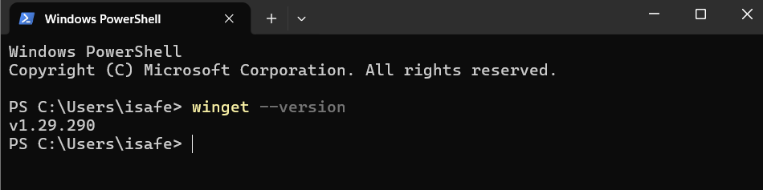
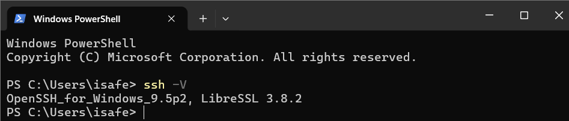
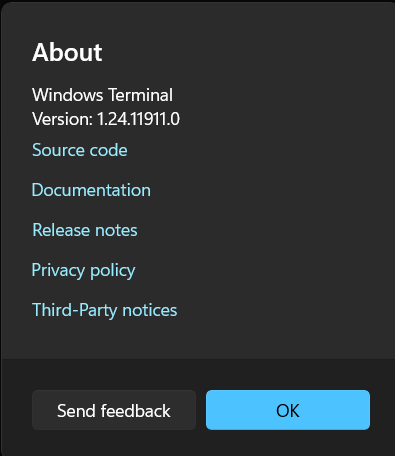
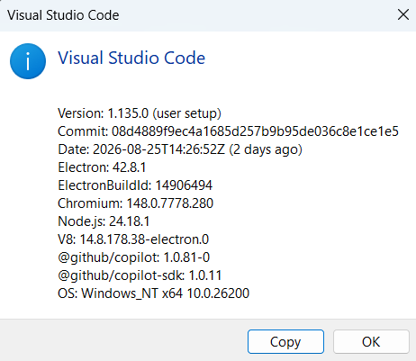
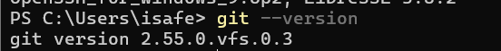
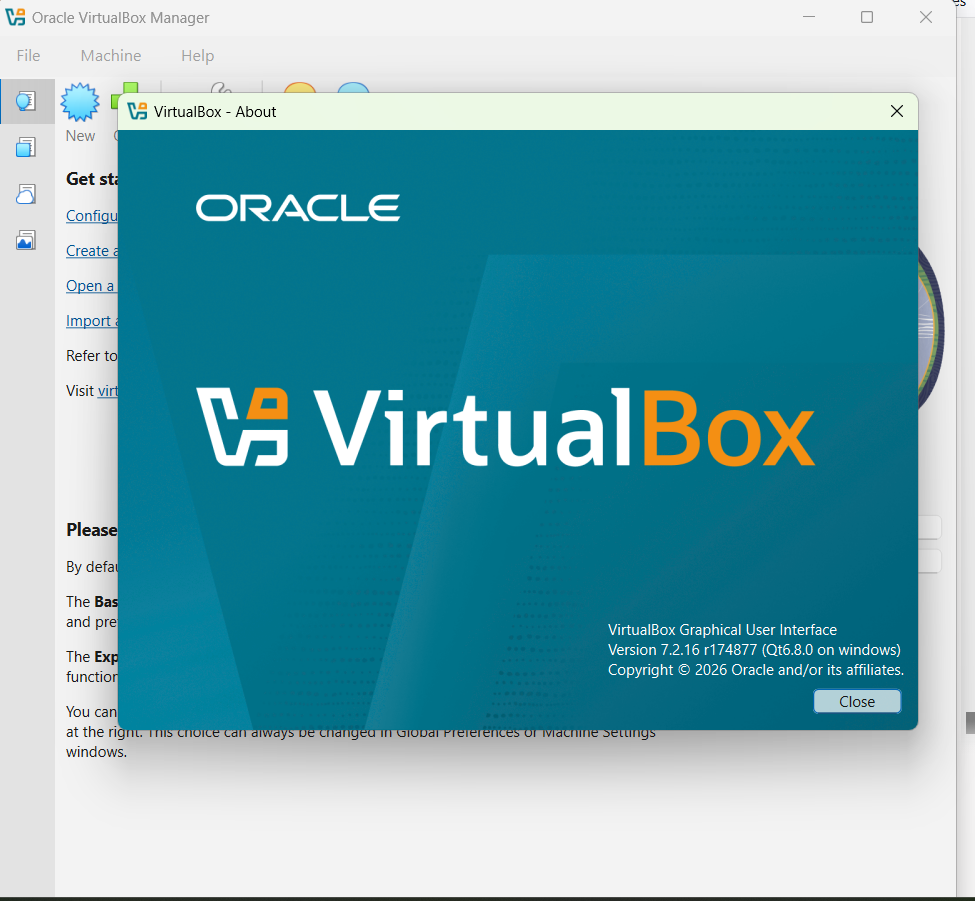
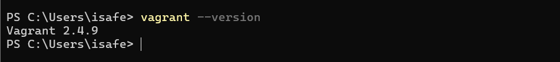

# Tooling Setup Assignment
**Name:** Isa Fernandez Sanchez
**GitHub ID:** isafernandezsanchez02-svg

## 1. Package Manager (WinGet)

## 2. Modern Shell and Terminal

## 3. IDE Editor (VS Code)

## 4. Version Control (Git)

## 5. Virtual Machines and Automation Tools

